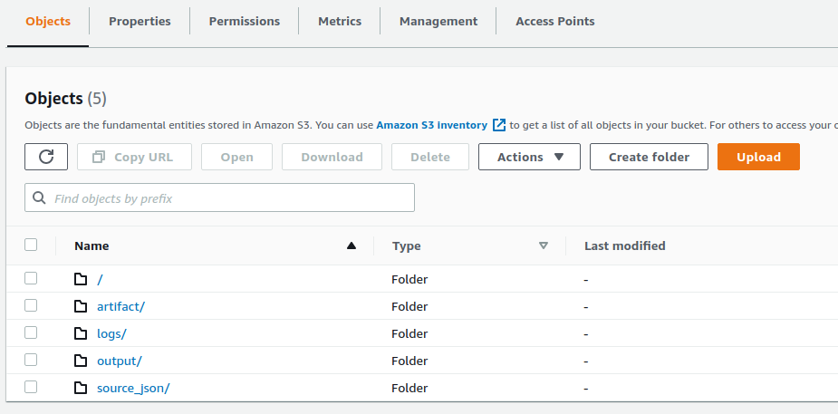

# LDA clustering with pyspark mllib

see the detailed report in notebook [here](LDA-Report.ipynb)

## How to run this PySpark job on EMR?

Submitting the job to EMR is easy

RUN: `bash emr.sh`

Under the hood following things happened:

1. Python code including settings will be packaged into local `./dist` folder as EMR job artifacts (see more in [package.sh](package.sh))
2. Local `./dist` then is uploaded to s3 under `artifact` prefix. (later referenced by EMR step)
3. Create new EMR cluster, it read raw data from `source_json`, run ETL job
4. Finally, it saves outputs (such as, transformed data, model, and visualization data files) under `output` prefix in s3.

see s3 folder structure: (`logs` is EMR log folder)

## What happens through the ETL process?

1. Read raw json file from source folder `source_json` in s3
2. Data clean and Feature engineering on product description:
   - remove html markups
   - remove punctuations and special characters
   - remove numbers
   - remove common stop words
   - then tokenize and vectoring product description corpus
3. Fitting feature data via LDA model
4. Save transformed data into s3 `output` folder
5. Save model artifacts
6. Save reports for data visualization

## How to start developing?

### check pre-requisite

- aws accounts
- credentials with emr/s3/airflow policy attached
- pyspark dev environment
- python,tox

### setting up dev environment

Create virtual dev environment via `tox`

RUN: `tox -e dev`

ACTIVATE: `:{your project root}$ source .tox/dev/bin/activate`

OPEN NOTEBOOK: `jupyter notebook`

Happy coding!

### How to run test?

`tox -e test`
